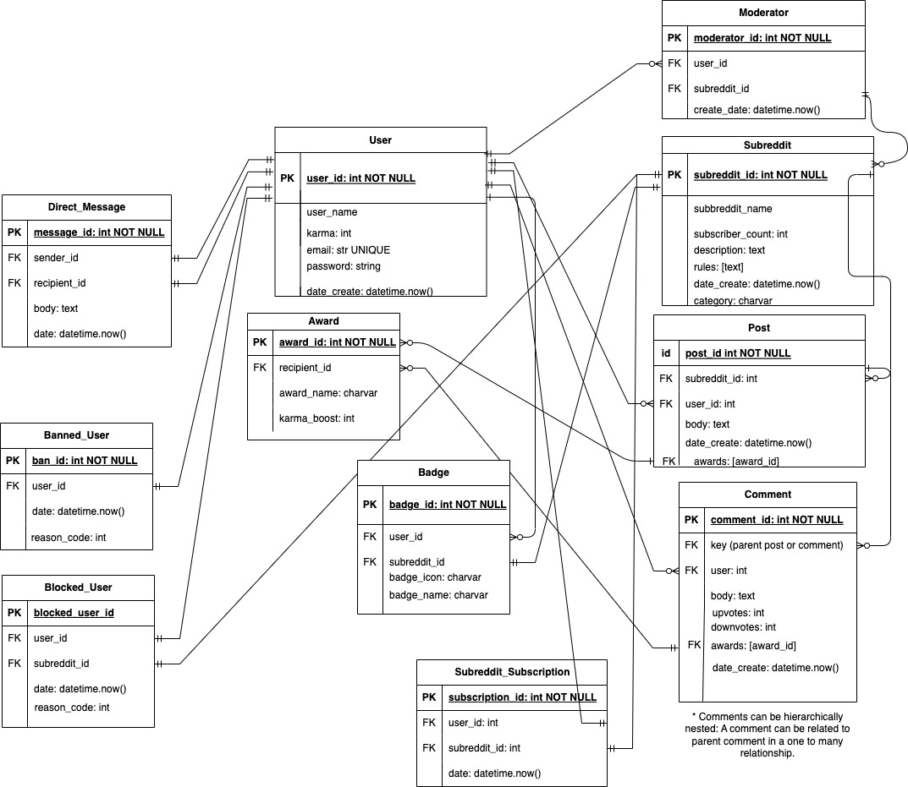

# BenjaminCampbell_T2A1
</br>
</br>

## Q1: Describe the architecture of a typical Flask application

The typical Flask application architecture aims to facilitate interactions between end-users and a programs logic and data. The application is designed to handle incoming user requests and serve a response of data. This response can be of different data types, including JSON objects or html templates. It implements routes paired with corresponding logic needed to respond with the requested data. 

Databases can be connected to a Flask application with logic written to facilitate full CRUD operations. A typical RESTful flask application interacts with a targeted database connected via modules such as SQLAlchemy, Marshmallow and psycopg. An Object Relational Mapper (ORM) such as SQLAlchemy is implemented to interface between Flask and the connected database, making interactions more seamless. ORM's generally use Models within the Flask app to structure database tables and implement instances of these models to add records to a database. 

User routes are constructed to interact with the database and in the most simple format will consist of a main index page, and a route to list an overview of all records from a targeted table. This route usually shares the same name as the table it is displaying. For instance a music store might list available instruments for sale with a route ```/instruments```. A user can select a record from this index to show more details pertaining to it, typically structured as ```table/record_id```. In our example the route might be ```/instruments/<instrument_id>```. These are the most basic elements of a read-only application. If an application implements create, update and delete functionality there will be routes for each of these actions with corresponding logic necessary for its implementation:
- The create route is constructed with a post request sent to the tables index route ```/table```. 
- An update is constructed with a put or patch request sent to the ```table/record_id``` route and the corresponding handler facilitates editing the record within its specified parameters and updating the correct record within the database. Although this can be accomplished with either a put or patch request the standard approach of construction uses the put request to re-write the entire record; a put request is generally more efficient and less prone to data errors.
- Deleting records is accomplished with a delete request to the ```table/record_id``` route with handler logic to drop the corresponding record from the database. 

If the application is web based it will implement HTML templates to render requested data. These templates integrate Python logic within an HTML structure so data can be displayed on a template framework. This eliminates the need for individual HTML pages for each instance of a record or table, instead injecting the data into a form template. 

Additionally, user authentication and authorization can be implemented if there are private or individualized concerns involved with the application. Third party packages can be imported to implement hashing and verification protocols. 

Although flask applications can take many forms to accomplish varied objectives this is just one example of a RESTful flask application geared towards a user interacting with data contained in a connected database. 

</br>

## Q2: Identify a database management system (DBMS) commonly used in web applications (including Flask) and discuss the pros and cons of this database

One popular database management system commonly used in web applications is PostgreSQL. It is open sourced and has over thirty-five years of support and development by an active community. Because of this PostgresQL enjoys frequent updates, addition of features and bug fixes. The open-source community has also developed extensive tools, libraries and frameworks which enable integration into many languages and project environments. These resources available allow for easy integration of the database into numerous web app environments. Although PostgreSQL does support NoSQL databases it is primarily aimed towards managing SQL databases - a database structure that was created in the early 1970's. This long history has created ample documentation and a set of tried and tested best practices for creating robust and efficient databases. PostgreSQL supports a great many data types including geolocation, geospatial as well as user defined data types and functions. PostgerSQL is adept at promoting data integrity and durability, implementing ACID (Atomicity, Consistency, Isolation, Durability) transactions, write-ahead logging (WAL) and point-in-time recovery. DDL, DML and DQL in PostgreSQL are extremely straightforward using directives that more closely resemble plain english than code. Because PostgreSQL is primarily designed for SQL databases it promotes well defined relational data structures that are strongly typed, with many optional constraints and validations with aim towards data integrity and robustness.

Because PostgreSQL is designed to scale vertically it can make large and quickly growing projects difficult or costly to keep up with growth. Vertical scaling requires upgrading storage, RAM and CPU capabilities in line with a projects growth - this can become costly and require frequent adjustment to cloud hosting packages. Querying on larger PostgreSQL projects can also become memory intensive and result in slower results, especially with more complex queries with complicated joins. As PostgreSQL is tailored to SQL databases it is generally not the best choice for NoSQL databases due to limited NoSQL features and support.


1. Pace, Brian. “Postgres WAL Files and Sequence Numbers.” Crunchy Data, 15 Feb. 2023, www.crunchydata.com/blog/postgres-wal-files-and-sequuence-numbers#. Accessed 9 June 2023.

2. “PostgreSQL Tutorial - Learn PostgreSQL from Scratch.” PostgreSQL Tutorial, www.postgresqltutorial.com.
‌


</br>

## Q3: Discuss the implementation of Agile project management methodology 

Agile project management is an approach to software development that follows four basic principles; a focus on individuals and their interactions, creating working software, integrating the stakeholder in the development process and the ability to dynamically adjust to and evolve with changing needs and conditions. Generally speaking this philosophy manifests itself practically by implementing:
 - Development in 'sprints' that deliver smaller features more frequently.
 - Smaller, self-organizing teams tackling targeted pieces of larger problems in shorter increments of time. These teams are generally heterogeneous and can contain product owners, developers and product testers. 
 - User stories and epics: In keeping with the Agile philosophy of placing people first user stories are ways to make tangible the features and components of the software being developed. They are vignettes to describe the ways users will interact with with the product. This illustrates the value the features will provide in a meaningful way. Similarly, epics describe features and products in larger, more involved scope.
 - Frequent deliveries of working software. 
 - Frequent review of both the product and the process to maximize productivity, quality of product and satisfaction of stakeholders. This can take the form of daily stand ups (shared personal accounts of development process) as well as cyclical and iterative reviews of sprints and features. 
- frequent and direct communication between individuals, teams and stakeholders to help define goals, maximize productivity and ensure quality of product. 
- An environment that welcomes change and evolution of design as it promotes value and competitiveness for the stakeholder. 


There are a number of frameworks which provide structured implementation plans for Agile development. Such frameworks include Crystal Clear, Kanban, Scrum and Extreme Programming. Agile frameworks are typically chosen to fit projects unique needs and culture while staying true to the core tenets of Agile methodology. 


1. Atlassian. “Get Started with Agile Project Management | Atlassian.”  Atlassian, 2019, www.atlassian.com/agile/project-management.

2. Cunningham, Ward. “Manifesto for Agile Software Development.” Agilemanifesto.org, 2001, agilemanifesto.org.

3. Radigan, Dan. “Project Management with Agile Principles.” Atlassian, 2022, www.atlassian.com/agile/project-management/project-management-intro.

4. Schwaber, Ken, and Jeff Sutherland. “Scrum Guide | Scrum Guides.” Scrumguides.org, 2020, scrumguides.org/scrum-guide.html.
‌
</br>

## Q4: Provide an overview and description of a standard source control workflow
There are many popular source control workflows software development projects can implement. Choosing the correct workflow largely depends on the nature, size and needs of the project at hand. One workflow that is particularly well suited for larger projects with many teams that may not be sharing the same physical location is Feature Branch Workflow. This approach implements feature branches to encapsulate development, leaving the main branch untouched during development. The feature branch also allows for thorough code review by teams before merging it into a main branch. It relies on features of both Git source control and external repository management platforms such as Bitbucket or Github for staging, committing, pushing, merging, rebasing and submitting pull requests. Benefits of this approach include leveraging pull requests via a repository management system for teams to review and assess code before merging. The pull request also acts a means of gatekeeping merges to ensure the Main branch only ever contains working code. A standard Feature Branch workflow cycle might look something like this:
- A developer clones the main code repository to their local working machine.
- Developer creates a new, descriptively named, feature branch and sets git upstream to the remote feature branch. This allows for code back-up and collaboration without disturbing the main branch. 
- Developer will work on planned feature, going through the standard stage, commit, push cycles until the feature is complete.
- At this stage a pull request for the feature branch is submitted.
- The pull request will be reviewed by team mates, commented on and either approved or have revisions requested. If revisions are required the developer will make them locally and push to the feature branch, in turn updating the pull request with revisions. 
- Once the pull request is approved the feature branch will be merged into the main branch. If merge conflicts occur they will need to be addressed fully for the merge to be successful. 
- After successful merge the feature branch will be deleted to keep the repository well organized and with optimized performance.
- The process then starts over again. 


1. Atlassian. “Git Feature Branch Workflow | Atlassian Git Tutorial.” Atlassian, 2019, www.atlassian.com/git/tutorials/comparing-workflows/feature-branch-workflow.

2. ---. “Git Workflow | Atlassian Git Tutorial.” Atlassian, 2010, www.atlassian.com/git/tutorials/comparing-workflows.

3. Hart, Brad. “Trunk Based Development or Feature Driven Development — What’s Better for Your Team?” Perforce Software, www.perforce.com/blog/vcs/trunk-based-development-or-feature-driven-development.
‌

</br>

## Q5:  Provide an overview and description of a standard software testing process (e.g. manual testing)

Testing strategies are integrated into the software development process to ensure robust design. It is imperative these tests are well constructed and diverse, regardless of if they are automated or executed manually. One standard software testing process is Unit Testing. Unit tests aim to isolate smaller units of code and run it through a series of tests ensuring it is functioning as expected. Many time the targets of unit tests are functions, methods and classes. A typical software development process includes writing unit tests alongside all code being created, ideally testing all functions and methods within it. Test Driven Development takes this idea one step further by writing tests before writing production code. A testing framework is utilized to create a testing environment that can be run independently of the main program, displaying and logging all test results with detailed error messages when a test fails. Test assertions are written with hard coded arguments and are compared to known and expected outcomes. When a function or method is structured to accept user input as arguments a technique know as monkey-patching can be implemented to provide controlled arguments. Unit tests can also be structured to test that expected errors are thrown when unexpected or incorrect data is passed as an argument to the logic being tested. Generally unit tests should not cross system borders such as databases or third party software as this can become cumbersome and is better suited to higher level testing frameworks. Unit testing is a powerful tool to guide software development and isolate problems when larger systems fail.


1. Smartbear. “What Is Unit Testing?” Smartbear.com, 2022, smartbear.com/learn/automated-testing/what-is-unit-testing/.
‌
</br>

## Q6: Discuss and analyse requirements related to information system security and how they relate to the project

As the new ACME app will require robust system security to protect user data and guard against malicious attacks such as sql injections and directory traversal. The project will require secure user accounts and protected administrator routes. A User database model will be created to manage authorization and authentication. Authentication is the first step to securing our app and can be implemented with session or JWT (JSON Web Token) based authentication. In session based authentication the server creates a new session after successful login which is stored in both the database and the users client as a cookie. Every subsequent client request will include the cookie which is compared to the session stored with that user. This method has drawbacks in that it is more difficult to scale as it requires more resources to store the session and continually validate requests on the server side. As ACME is already large and continually growing, and the app will include mobile versions a more suitable approach would be JWT based authentication. In JWT based authentication the server creates a token with a header, payload and signature secret which is sent to the client and stored locally. This token is included in the HTTPS header for each request to authenticate and detect in-transit tampering. Authentication best practices rely on strong user passwords which should always be hashed and salted before adding to the database session and committed. Authorization roles are created to ensure administrator routes are protected from general use. Care is taken in how they are stored and accessed in the database to protect them from malicious attacks and code injections. CSRF tokens will be implemented to guard against cross-site request forgery. Lastly, the app should only be served securely over HTTPS to protect data transmitted between the client and server.  


1. “Best Practices for Flask Security.” SecureCoding, 14 Jan. 2021, www.securecoding.com/blog/flask-security-best-practices/.
2. Hsu, Sherry. “Session vs Token Based Authentication.” Medium, 27 July 2018, sherryhsu.medium.com/session-vs-token-based-authentication-11a6c5ac45e4.
3. S, Kirsten. “Cross Site Scripting (XSS) | OWASP.” Owasp.org, Owasp, 2020, owasp.org/www-community/attacks/xss/.
‌

</br>

## Q7: Discuss common methods of protecting information and data and how you would apply them to the project

To secure data on the new ACME project many security vulnerabilities must be anticipated. Authentication will be handled by flask_JWT and used to generate and manage authentication tokens and verify user requests. BCrypt will be used to encrypt sensitive information such as passwords before they are added to the database session and committed to the database. It is imperative that no un-hashed password is to be stored at any time. Rate limiting to protect against brute force attacks would be implemented via Flask-Limiter. All user roles would be protected by limiting visibility and access throughout the app by excluding them from all non pertinent contexts. Sensitive information such as JWT secrets and database connection strings will be handled judiciously and encapsulated in untracked, secure modules. Marshmallow schemas and Jinja2 will be used to sanitize and validate all user input to protect against malicious code injection attacks. Cross-Site Request Forgery will be preempted by implementing flask-WTF in all user input forms. If the ACME app implements file upload the protocol will be to rename all incoming files to avoid directory traversal leading to root directory corruption. Lastly, system security requires continual foresight and care - Flask and Flask dependencies should be updated frequently to incorporate security patches and protect against evolving security threats. Continual testing of potential penetration and vulnerability risks would be implemented throughout the lifecycle of the app to ensure consistent system security and data integrity.

1. “Best Practices for Flask Security.” SecureCoding, 14 Jan. 2021, www.securecoding.com/blog/flask-security-best-practices/.


</br>

## Q8: Research what your legal obligations are in relation to handling user data and how they can be met for the project

As the ACME Corporation is a large organization with an annual turnover over 3 million dollars the Project must adhere to Australian Privacy Principles (APPs), the cornerstone protection of the Australian Privacy Act of 1988. The guidelines that can be incorporated into the ACME app to ensure compliance are clearly delineated and include:
- Managing personal information collected from users in an open and transparent manner, providing a clear Privacy Policy available for all users. (APP 1)
- Providing an option for pseudonymous registration if users do not want to identify themselves. (APP 2)  
- Ensuring that the app will not store or utilize any information collected passively (APP 4)
- Providing users the ability to opt-out of direct marketing and ensure this option is honored (APP 7)
- Collecting and storing all provided information responsibly and securely to guard against any breaches of personal information, malicious or otherwise. (APP 11)

These are the minimum obligations that must be met to ensure legal compliance with regard to user data in the current iteration of the App. It is important to keep front of mind that ACME's legal obligations must be revisited with every new App version and feature release to ensure continual legal compliance.   


1. “Home | Consumer Data Standards.” Consumerdatastandards.gov.au, consumerdatastandards.gov.au. Accessed 9 June 2023.

2. “IT Requirements for Data Recipients | Consumer Data Right.” Cdr.gov.au, 2023, www.cdr.gov.au/for-providers/it-requirements-data-recipients.

3. OAIC. “Rights and Responsibilities.” OAIC, 10 Mar. 2023, www.oaic.gov.au/privacy/privacy-legislation/the-privacy-act/rights-and-responsibilities.

4. Office of the Australian Information Commissioner. “Australian Privacy Principles Quick Reference.” OAIC, 2022, www.oaic.gov.au/privacy/australian-privacy-principles/australian-privacy-principles-quick-reference.
‌
</br>

## Q9: Describe the structural aspects of the relational database model. Your description should include information about the structure in which data is stored and how relations are represented in that structure  


A relational database is a collection of related tables, comprised of columns(attributes) and rows(records or tuples). Because a database aims to represent complex real-world entities with many interwoven relations it is necessary to model a database logically and thoroughly before physically implementing it. One tool to examine and create relational structures is the entity relationship diagram or ERD. An ERD aims to plot out all attributes of a collection of entities and define how they relate to each other. These relationships can help reveal necessary additional tables and structure more complex relations efficiently. Each table must have a unique name and may specify an attribute as a primary key. This primary key value must be unique to the column to which it belongs (eg. a customer id or product model number). Tables can link to other tables by specifying an attribute as a foreign key. This foreign key generally references another tables unique primary key as an identifier. Database relationships can be described by the number of possible connections they may have to each other such as zero, zero or one, zero or many, one or many, many etc. This can be illustrated in the relationship between a director and a film: a director can direct many films, but generally a film only has one director - this relationship would be described as one to many. It is important to note that relational databases do not support many to many relationships thus a new joining table must be implemented to achieve the proper data structures. Once a database model has been thoroughly conceived a physical database can then be constructed.  Relational Databases use schemas to define entities and the relationships between them and the commands used for this process are aptly referred to as  Data Definition Language (DDL). Within these schemas column names and their allowed data types are defined, primary and foreign keys are designated and the relationships between tables are made clear. Schemas also offer further functionality such as unique serialization for identification of attributes or date/time objects. 

</br>

## Q10: Describe the integrity aspects of the relational database model. Your description should include information about the types of data integrity and how they can be enforced in a relational database.


In the relational database model data integrity is of utmost concern. It is imperative to keep the data sanitized and the database optimized and free of unforeseen errors. There are many tools provided to ensure the integrity of a database including strongly typed schemas, attribute constraints and normalization.  

Relational database attributes are strongly typed: when defining schemas a data type must be given. This is the first layer to ensuring data integrity by clearly defining expected and allowed data types.  

Attribute constraints help sanitize data by requring specified criteria are met, safeguarding against unforeseen database and logical errors. There are many constraints a user can implement including string length parameters, integer value and range and requiring a value be present (not null) or unique. 

Primary and Foreign key constraints define the relational structures of a database. A primary key must be both unique and not null - thus these are implicit constraints when specifying a primary key. Foreign key constraints reference a separate tables primary key - another convention that ensures the expected behavior from a relational model. 

Assigning a foreign keys behavior on delete and update is one more layer to ensuring data integrity. A user may specify what happens to the referenced data when a record is deleted or updated. Options include ```ON DELETE CASCADE``` , ```ON DELETE NULL```  and ```RESTRICT``` which will prevent any further alteration of the referenced data. 

Implementing ACID (Atomicity, Consistency, Isolation, Durability) for all transactions safefuards against corrupted data due to failed transactions. Atomicity ensures transactions are either completely executed or not executed at all. Consistency checks that all data are adhering to all definted expectations and parameters. Isolation ensures transactions remain isolated from one another and therefore cannot interact with in-progress transactions. And lastly durability means that once a transaction is committed and a success message sent it has been stored in the system permanently, even if a hardware failure occurs directly after. 

Finally, data normalization is one of the most integral steps to ensuring data integrity and performance. Normalization is a process that aims to structure (or restructure) a data base according to a proscribed set of steps with a key focus to reducing duplication. Data duplication creates a significant threat to data integrity by increasing the likelihood of data inconsistencies. Additionally, it can cause performance issues by requiring the same data to be updated or deleted in multiple tables and inflate database size by storing redundant data in multiple locations. The normalization process steps through three main normal forms to systematically restructure a database, reducing redundancy and promoting logical and efficient data structures. 

“What Does ACID Mean in Database Systems?” Database.guide, 20 June 2016, database.guide/what-is-acid-in-databases/#:~:text=All%20of%20the%20major%20relational. Accessed 9 June 2023.
‌
</br>

## Q11: Describe the manipulative aspects of the relational database model. Your description should include information about the ways in which data is manipulated (added, removed, changed, and retrieved) in a relational database.  


Relational Databases offer extensive functionality to manipulate and query the data held within them. The commands used to manipulate the data are referred to as Data Manipulation Language or DML. Using DML commands in concert with one another provide limitless ways to access and manipulate singular or multiple records simultaneously. There are four main DML commands which are:
- ```INSERT```: Insert facilitates the creation of new rows within a table. A common example of an insert command might look something like:
    ```SQL
    INSERT INTO <your_table> (attribute_1, attribute_2) VALUES (your_new_data_1,    your_new_data_2);
    ```
- ```SELECT```: The select statement is used to query and filter data from the database. There are a plethora of ways to filter and group data queries using conditional expressions, subqueries, sorting, grouping, filtering and joining of multiple tables. Many DBMS's also provide functionality to operate on data within a table including operations such addition, average, count, minimum and maximum. The methods available to be combined with the ```SELECT``` statement are limitless and powerful but a simple select statement might look something like this: 
    ```SQL
    SELECT attribute_1, attribute_2 FROM your_table WHERE attribute_1 = desired_condition;
    ```
- ```UPDATE```: The update keyword is used to edit and update data within a table. Typically the command declares a table it would like to update, defines the attribute within it to be updated and a new value for that attribute and finally a conditional clause to filter the precise data to be updated. If no conditional clause is given it will update all rows in the table. An update command may look something like: 
    ```SQL
    UPDATE <table_name>
    SET <attribute_name> = new_value
    WHERE unique_instance_ID = desired_target_ID;
    ```
- ```DELETE```: Delete is used to remove a row or rows of data. Like the update keyword it specifies a table and generally uses a filtering where clause to target the desired data to be deleted. If no conditional filter is applied it will delete all rows from the table. The syntax might look something like: 
    ```SQL
    DELETE FROM <your_table_name>
    WHERE <desired_condition_is_met>;
    ```
</br>

## Q12: Conduct research into a web application (app) and answer the following parts: 
- a. List and describe the software used by the app.
- b. Describe the hardware used to host the app.
- c. Describe the interaction of technologies within the app
- d. Describe the way data is structured within the app
- e. Identify entities which must be tracked by the app
- f. Identify the relationships and associations between the entities you have identified in part (e)
- g. Design a schema using an Entity Relationship Diagram (ERD) appropriate for the database of this website (assuming a relational database model) 

### **Reddit**
- A) Reddit backend is largely written in Python using the Pylon framework. PostgreSQL is used for the backend database and SQLAlchemy, Memcached, RabbitMQ, HAProxy, mcrouter, and cassandra are utilized for further functionality. The Reddit frontend logic is handled by a JavaScript/React/Redux/Node stack as well as HTML and CSS. Authentication is handled by an integrated Google Identity OAuth and JWT's. Hashing of sensitive data is accomplished with Bcrypt.


- B) The hardware utilized to host Reddit consists mainly of servers for handling requests and business logic, routers for networking, load balancers to distribute large traffic volumes equally across physical resources and a vast storage infrastructure to accommodate physical data bases. Reddit servers also require large and robust RAM configurations to accommodate heavy usage of Memcached functionality. In 2009 Reddit migrated to Amazon Web Services (AWS), utilizing their vast data centers which implement specialized and proprietary hardware configurations.


- C) In a typical Reddit user interaction an end user will access Reddit via a client (mobile app or web browser), sign-in with authentication handled by Google Identity Services and request a resource sent via HTTPS. If authentication is successful a request is sent to the backend API via a route handled by Pylon/Python. Any database CRUD actions will then be handled by SQLAlchemy as well as Memcached, a key-value data caching structure heavily utilized by Reddit. This cache receives over 800,000 get requests per second and is stored in RAM instead of on disk. The backend API then serves a response to the frontend, usually in JSON format. The frontend will take this response and update or construct a new view using HTML, CSS, React and Javascript which is then returned and rendered by the client. Each request/response cycle is atomic, with authentication verification (included in HTTPS Headers) for each interaction. 

- D) Earlier versions of Reddit utilized an Entity–attribute–value model that used two tables per entity (thing table and data table, eg. <entity>_thing & <entity>_data) . It is possible they have completely restructured their data model since, but in examining the Reddit Repository which was current as of 2017(before being made private) remnants of the EAV structure persisted. The data model implemented as of this date is highly complex and utilizes many model/class methods to implement functionality that would traditionally be performed by PostgreSQL DQL and DML. The 'things' table stores attributes of up/down votes, type and creation date. The data table stores three main attributes: thing id, key and value. Every 'thing' record has a corresponding 'data' record. Every tracked entity is utilizes these two tables and may contain multiple associated records to store all data relevant. Additionally relationships between entities are structured in this same manner as traditional SQL joins are near impossible with this data structure. It is possible this key/value data structure was implemented to correspond with a heavy reliance on Memcached, also key/value structured. In researching the reasoning behind this data structure strengths outlined were faster and less complicated maintenance, development and deployment. Weaknesses mentioned were more difficult data constraints and validation, and limited availability of the usual tools and strengths of a relational database. These shortcomings were ameliorated at the application level.

- E) The main entities Reddit must track are Subreddits (different areas of interest on the Reddit site), Posts (The individual instances of content that appear on subreddits), comments (On posts, and nested under other comments), karma, bans (individuals and subreddits who have privileges revoked), blocked users (users blocked only from particular subreddits for rule violations) awards/trophies, badges, subscriptions, ads, messages, rule sets, subreddit moderators and users. Additionally, due to Reddit's legacy use of an Entity–attribute–value model relationships may also still tracked as entities, as opposed to being defined within models as in most relational databases. 


- F) Relationships and associations between Reddit entities are likely many and labyrinthine. A possible list of entity relationships and associations: 
    - Users can be related to banned users, blocked users, comments, messages, moderators, submissions and subreddit subscriptions. They can also be associated with awards/trophies, badges and karma
    - Subreddits can be related to subreddit subscriptions, banned subreddits, blocked users, rules and submissions
    - Subreddit subscriptions are related to users and subreddits
    - Awards/trophies are related to to users
    - Badges are related to users and associated with subreddits
    - Posts can be related to subreddits, users, trophies/awards and associated with comments, karma and ads
    - Direct Messages are related to users and associated with users
    - Comments are related to users and can be associated with both posts and other comments.
    - Ads might be associated with subreddits and users depending on how they are targeted and implemented

- G) A generalized ERD of the relationships contained the Reddit database might broadly resemble this structure:



1. “7 Lessons Learned While Building Reddit to 270 Million Page Views a Month - High Scalability -.” Highscalability.com, highscalability.com/blog/2010/5/17/7-lessons-learned-while-building-reddit-to-270-million-page.html. Accessed 9 June 2023.

2. KeyserSosa. An Update on the State of the Reddit/Reddit and Reddit/Reddit-Mobile Repositories. 1 Sept. 2017, www.reddit.com/r/changelog/comments/6xfyfg/an_update_on_the_state_of_the_redditreddit_and/. Accessed 9 June 2023.

3. November 2018, Anthony Spadafora 27. “AWS Launches Own Server Hardware.” TechRadar, www.techradar.com/news/aws-launches-own-server-hardware.

4. “Reddit-Archive/Reddit.” GitHub, 9 June 2023, github.com/reddit-archive/reddit. Accessed 9 June 2023.
‌

